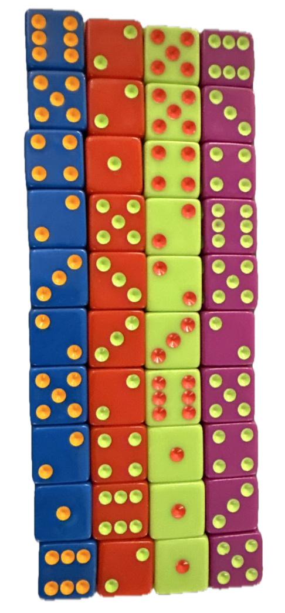

<!-- DIRECTIONS -->
```{r directions, include=FALSE}
# DIRECTIONS
# 

# Come up with a chi squared test analysis of your own creation. 
# 
# * Write the Background and clearly state your question. Then collect data and perform the chi-squared test analysis in order to answer your question. Use the proper order of first, ask the question, then second, figure out the answer.
# 
# * You can use data from 
#     - An R data set
#     - the internet (like weather data, Facebook data, or sports data) 
#     - your own experiment 
#     - your own observational study
# * However,     
#     - Do not violate the "Human Subjects Rules" of the university: http://www.byui.edu/executive-strategy-and-planning/institutional-research/research-and-assessments/research-and-surveys
# 
# * You need a sample size large enough to meet the requirements of the chi squared test. Unfortunately, the sample size is completely dependent on the situation you select. A good rule of thumb is 10 observations per "combination-group" in your data.
```

<!-- IMPORTS -->
```{r imports, warning=FALSE, message=FALSE}
# Libraries
pacman::p_load(knitr, kableExtra, DT, janitor, pander, tidyverse)

# Data
data   <- read.csv("../../data/dice.csv")
dice <- data %>% select(trial, roll, color, dot, number) %>% 
  drop_na() %>% 
  mutate(
    color = factor(color, levels = c("Blue", "Red", "Green", "Purple")))

# Helper: Colors
helper <- data %>% select(h_die_color, h_die_hexcode, h_dot_color, h_dot_hexcode) %>% head(4)
```

<!-- DATA WRANGLING -->
```{r data_wrangling_1}
# Table of counts
counts <- table(
  Color = dice$color,
  Number = dice$number
  )

# Dataframe of counts
counts_df <- as.data.frame(counts)
```


## Background

<!-- Image -->
<figure style="float: right; width:150px; margin: 0 0 10px 15px;">
  <a href = "https://ilovetenzi.com/product/tenzi-dice-game/Tenzi">
    
  </a>
  <figcaption style="color: gray; font-style: italic; font-size: 12px; text-align: center">
    Figure 1. </BR>Colored Dice Sets
  </figcaption>
</figure>

<!-- Text: -->

<!--  (1) -->
##### **Introduction** </BR>
<!-- paragraph -->
From the popular dice based game [Tenzi](https://ilovetenzi.com/product/tenzi-dice-game/Tenzi), four sets of 10 six-side colored dice (
<strong style="color: #2c4e7a;">"blue"</strong>, 
<strong style="color: #c32b13;">"red"</strong>,
<strong style="color: #b8dc45;">"green"</strong>, and
<strong style="color: #ad2b6e;">"purple"</strong>; see *Figure 1*.) are used to play the game. The company's website explains,

<!-- block quote -->
<a href="https://ilovetenzi.com/product/tenzi-dice-game/Tenzi" style="text-decoration: none; color: inherit;">
  <blockquote style="margin-left: 0px; margin-right: 190px; font-style: italic; font-size: 14px; background: #E8F3FE; padding:10px;">
    The world’s fastest game! Everyone gets ten dice. Someone says, “Go.”
    Then everyone rolls as fast as they can until someone gets all their dice
    on the same number and shouts “TENZI.” Lots of different ways to play.
    A fun, fast frenzy for the whole family!
  </blockquote>
</a>

<!-- (2) -->
##### **Question** </BR>
Are the **`color`** of a die and the **`count`** of the numbers rolled **independent variables**?

<!-- (3) -->
##### **Methodology** </BR>
To investigate our question, because this data fits into a cross-table structure we can use a **Chi Sqared Test** accompanied by appropriate hypotheses and a test of assumptions (see *Diagnostic Plots*).

<!-- (4) -->
##### **Prodcedure** </BR>
Clearly achieving a satisfactory sample size, **15 trials** $(t)$ were conducted where the four dice sets $(n_t = 40_\text{dice})$ were rolled all together in a dish $(n = 600_\text{rolls})$. The die **`color`** and **`number rolled`** were recorded for each die. The data were then aggregated into a table of counts with *Color* the row header and *Count* the column header.

</BR>

**Table of Counts - Dice Roll Data**
```{r table_of_counts}
knitr::kable(
  counts,
  col.names = colnames(counts),
  align = "l",
  row.names = TRUE
  ) |>
  kableExtra::kable_styling(full_width = FALSE, position = "left") |>
  kableExtra::column_spec(1, width = "100px") |>
  kableExtra::column_spec(2:7, width = "50px")
```


## Data {.tabset .tabset-face .tabset-pills}

```{r}
#remove one unused row
dt_full_data <- dice %>% 
  select(-dot) %>% 
  rename(
    Trial = trial,
    Roll = roll,
    Color = color,
    Number = number
  )
```

### Sample Data

Randomly, 10 rows were picked (see code below) to produce a *pseudo* random sample for our intents and purposes representative of the data. For full context, click the next tab to view, search, and filter the full data set (600 rows).

```{r}
# Approximately representative row sample
slice_sample(dt_full_data,n=10) %>% 
  pander()
```

</BR>

---

### Full Data

```{r}
#full data
datatable(
  dt_full_data,
  options = list(
    #pages
    lengthMenu = list(c(5,10,40,120, -1), c("5","10","40","120", "All")),
    #col width
    autoWidth = TRUE
  ))
```

</BR>

---


## Chi Square Test

**Test Results:**
```{r}
# Chi-Square Test
test_results <- chisq.test(counts)
test_results %>% pander()
```

**Expected:**
```{r}
test_results$expected %>% pander()
```

**Residuals**
```{r}
test_results$residuals %>% pander()
```


> **Graphic**

<!-- HELPER -->
```{r barplot_helper}
# Color Lists
die_hexcodes <- helper$h_die_hexcode
names(die_hexcodes) <- helper$h_die_color

dot_hexcodes <- helper$h_dot_hexcode
names(dot_hexcodes) <- helper$h_dot_color

# Values
max_count <- max(table(dice$color, dice$number))
```


<!-- Graphic 1 - Barplot by die `color`-->
```{r, warning=FALSE, message=FALSE}
ggplot(dice, aes(x = number, fill = color)) +
  labs(
    title = "Total Counts of the Numbers Rolled by Die Color",
    y = "Frequency",
    x = "Number Rolled (pip)",
    fill = "Die Color",
    caption = "Graphic 2."
  ) +
  geom_bar(position = "stack") +
  facet_wrap(~ color, ncol = 4) +
  geom_text(
    stat = "count",
    aes(label = after_stat(count)),
    vjust = -0.5,
    size = 3
  ) +
  scale_fill_manual(values = die_hexcodes) +
  scale_x_continuous(breaks = c(1,2,3,4,5,6))+
  scale_y_continuous(
    limits = c(0, max_count + 1),
    breaks = seq(0, max_count + 1, by = 2)
  ) +
  theme_classic()+
  theme(
    plot.caption = element_text(hjust = 0, color="gray30", face="italic"),
    legend.position = "none",
    panel.background = element_rect(fill = NULL, color = "black", linewidth = .7)
  )
```


<!-- Graphic 2 & 3 - Scatterplot w/ Heatmap; faceted by die `color` -->
```{r}
# Base
scatterplot_heatmap <- ggplot(dice, aes(x=trial, y=number)) +
  geom_point(alpha = 0.3) +
  stat_density_2d(
    aes(fill = after_stat(density)), 
    geom = "raster",
    contour = FALSE
    ) +
  scale_fill_viridis_c(option = "inferno") + # or: "viridis", "magma", "plasma", "inferno", "cividis", "turbo"
  scale_y_continuous(breaks=1:6) +
  scale_x_continuous(breaks = 1:15)


# All together (not faceted by die `color`)
scatterplot_heatmap + #show
  labs(
    title = "Density of Number Rolled",
    subtitle = "All Die Colors and all Trials",
    x = "Trial",
    y = "Number",
    caption = "Figure [#]"
  )

# Faceted  (by die `color`)
scatterplot_heatmap_faceted <- scatterplot_heatmap +
  facet_wrap(~ color) +
    labs(
    title = "Density of Number Rolled (Pip)",
    subtitle = "Die Colors Separate for all Trials",
    x = "Trial",
    y = "Number",
    caption = "Figure [#]"
  )
scatterplot_heatmap_faceted #show
```


</BR></BR></BR></BR>

---

## Exploration {.tabset .tabset-fade .tabset-pills}

### Hide

*Click a tab to view more.*

</BR></BR></BR></BR>

---

<!-- ### Show -->

### `glimpse()` {.tabset .tabset-fade .tabset-pills}

<!-- ### Glimpse {} -->

#### **Raw data**
```{r}
glimpse(dice) %>% pander()
```

#### **Table: Counts**
```{r}
glimpse(counts) %>% pander()
```

#### **Dataframe: Counts**
```{r}
glimpse(counts_df) %>% pander()
```


### Not Using

<!-- Graphic 1 - Plot `dice`; geom_bar() auto-calculates counts -->
```{r, warning=FALSE, message=FALSE}
ggplot(dice, aes(x = color, fill = color)) +
  labs(
    title = "Total Counts of the Numbers Rolled by Die Color",
    y = "Frequency", 
    x = "Die Color",
    fill = "Die Color",
    caption = "Graphic 1."
  ) +
  geom_bar(width = .85) +
  facet_wrap(~ number, ncol = 6) +
  geom_label(
    stat = "count",
    aes(label = after_stat(count)),
    vjust = -0.2,
    size = 3,
    fill = NULL,
    color = "black",
    alpha = .7,
    linewidth = 0,
    # position = position_stack(vjust = .5)
    position = position_dodge(1.3)
  ) +
  scale_fill_manual(values = die_hexcodes) +
  scale_y_continuous(
    limits = c(0, max_count + 1),
    breaks = seq(0, max_count + 1, by = 2)
  ) +
  scale_x_discrete(expand = c(0, 0)) +
  theme_classic() +
  theme(
    plot.caption = element_text(hjust = 0, color="gray30", face="italic"),
    legend.position = "top",
    axis.text.x = element_blank(),
    axis.title.x = element_blank(),
    axis.ticks.x = element_blank(),
    panel.border = element_rect(color = "black", fill = NA, linewidth = 1),
    panel.spacing = unit(1, "lines")
  ) 
```


</BR></BR></BR></BR>

---

## Tasks

- [x] \ \ 1. Convert `color` into a factor?
- [ ] \ \ 2. 
- [ ] \ \ 3. 
- [ ] \ \ 4. 
- [ ] \ \ 5. 


<!-- End of page white space -->
</BR></BR></BR></BR></BR>


<!-- ==================== -->
<!--       FILE END       -->
<!-- ==================== -->